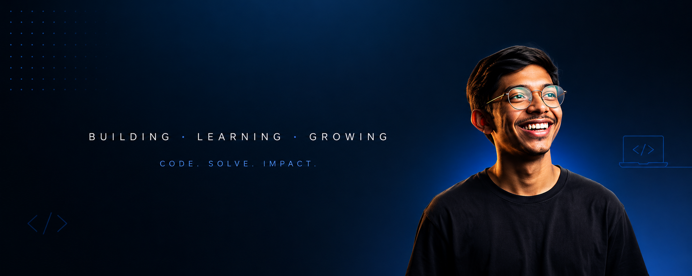

# Hi 👋 I'm Kavya Patel

### 🚀 AI Enthusiast • Full Stack Learner • Future Software Engineer

---

## 💫 About Me

🎓 First Year B.Tech Information Technology Student

🌍 Building practical projects instead of just completing assignments.

🤖 Passionate about Artificial Intelligence, Web Development and Product Building.

🚀 Currently participating in **Lakshya 2047**, exploring future technologies and innovation.

💡 I enjoy transforming ideas into real applications while continuously improving my problem-solving skills.

---

## 🚀 Currently Learning

- 🌐 Full Stack Development
- 🤖 Artificial Intelligence
- 📱 Next.js
- ☁️ Git & GitHub
- 🧩 Data Structures & Algorithms

---

# 💻 Tech Stack

---

---

# 🚀 Featured Projects

### 🌍 Traveloop
AI-powered travel planning platform.

### 🏥 Hospital Management System
Python + Pandas based management software.

### 🛒 Shri Siddhi Vinayak Trading Website
Modern product catalogue website built using Next.js.

### 🎬 Netflix Clone
Responsive Netflix landing page using HTML & CSS.

---

# 📫 Connect With Me

---

### 💭 Quote

*"Build. Learn. Improve. Repeat."* 🔥

